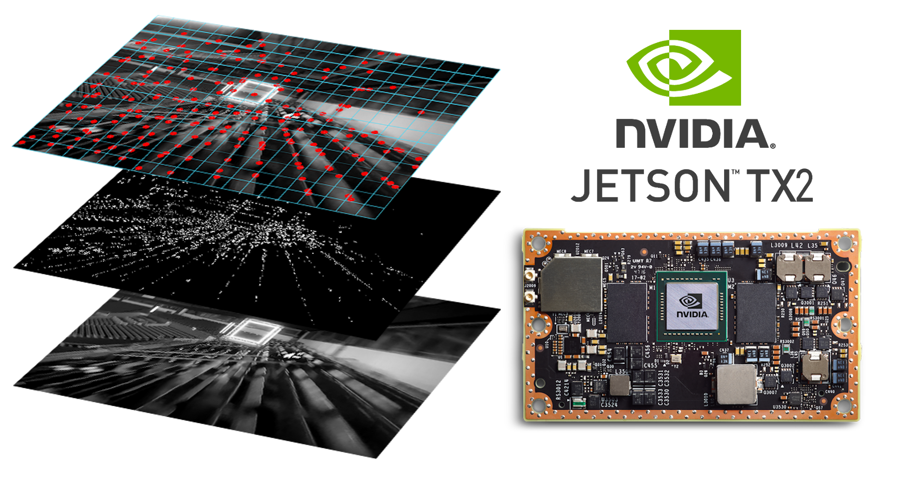

# CUDA Visual Library

This repository holds some GPU optimized algorithms by the "Robotics and Perception Group" at the Dep. of Informatics, "University of Zurich", and Dep. of Neuroinformatics, ETH and University of Zurich.

<a href="https://youtu.be/5Ndi9IYpI68" target="_blank"></a>

## Publication

If you use this code in an academic context, please cite the following [IROS 2020 paper](http://rpg.ifi.uzh.ch/docs/IROS20_Nagy.pdf).

Balazs Nagy, Philipp Foehn, and Davide Scaramuzza: **Faster than FAST: GPU-Accelerated Frontend for High-Speed VIO**, IEEE/RSJ Int. Conf. on Intelligent Robots and Systems (IROS), 2020.

```
@inproceedings{Nagy2020,
  author = {Nagy, Balazs and Foehn, Philipp and Scaramuzza, Davide},
  title = {{Faster than FAST}: {GPU}-Accelerated Frontend for High-Speed {VIO}},
  booktitle = {IEEE/RSJ Int. Conf. Intell. Robot. Syst. (IROS)},
  year = {2020}
}
```

## Organization

This library focuses on the front-end of VIO pipelines. We tried to organize
functionalities into the following categories:

 * **Storage:** various storage related functionalities
 * **Preprocessing:** image preprocessing functionalities 
 * **Feature detection:** various functionalities for feature detection, feature detectors
 * **High-level functionalities:** more sophisticated algorithms for other front-end tasks

## Getting started on a CUDA-enabled desktop computer

The following guide was written for Ubuntu 18.04, but one should proceed similarly on other OS-es. This guide attempts to install the **latest** CUDA toolkit and driver directly from NVIDA. Through the package manager of your OS (e.g.: apt, yum), you should be able to install an NVIDIA driver and the CUDA toolkit with a *one-liner*.

```sh
# Download the latest NVIDIA CUDA Toolkit from their website:
# Note: I specifically downloaded the .run file, but the others should also
#       suffice
https://developer.nvidia.com/cuda-toolkit

# Enter console-only mode (on next start-up)
sudo systemctl set-default multi-user.target

# Reboot
sudo shutdown -r now

# Log in and remove old display drivers
# i)  Remove the Nouveau driver
# ii) Remove the previously installed NVIDIA driver
sudo apt --purge remove xserver-xorg-video-nouveau
sudo apt purge nvidia*

# Reboot
sudo shutdown -r now

# Now there shouldn't be any display-specific kernel module loaded
lsmod | grep nouveau
lsmod | grep nvidia

# Run the installer
# Note: I didn't run the nvidia-xconfig on a multi-GPU laptop
sudo ./cuda_10.0.130_410.48_linux.run

# Add the executables and the libraries to the appropriate paths:
# Open your .bashrc file
vim ~/.bashrc
# ... and append to the bottom (you might need to change the path)
# for the CUDA 10.0 Toolkit
export PATH=/usr/local/cuda-10.0/bin:${PATH}
export LD_LIBRARY_PATH=/usr/local/cuda-10.0/lib64:${LD_LIBRARY_PATH}

# Return to the graphical mode (on next start-up)
sudo systemctl set-default graphical.target

# Reboot
sudo shutdown -r now

# Log in and verify
nvidia-smi
# Example output:
# +-----------------------------------------------------------------------------+
# | NVIDIA-SMI 410.48                 Driver Version: 410.48                    |
# |-------------------------------+----------------------+----------------------+
# | GPU  Name        Persistence-M| Bus-Id        Disp.A | Volatile Uncorr. ECC |
# | Fan  Temp  Perf  Pwr:Usage/Cap|         Memory-Usage | GPU-Util  Compute M. |
# |===============================+======================+======================|
# |   0  GeForce GTX 960M    Off  | 00000000:01:00.0 Off |                  N/A |
# | N/A   61C    P8    N/A /  N/A |    442MiB /  4046MiB |      0%      Default |
# +-------------------------------+----------------------+----------------------+
#
# +-----------------------------------------------------------------------------+
# | Processes:                                                       GPU Memory |
# |  GPU       PID   Type   Process name                             Usage      |
# |=============================================================================|
# |    0      1378      G   /usr/lib/xorg/Xorg                           193MiB |
# |    0      1510      G   /usr/bin/gnome-shell                         172MiB |
# |    0      3881      G   ...-token=CD62689F151B18325B90AE72DCDA2460    73MiB |
# +-----------------------------------------------------------------------------+

nvcc --version
# Example output:
# nvcc: NVIDIA (R) Cuda compiler driver
# Copyright (c) 2005-2018 NVIDIA Corporation
# Built on Sat_Aug_25_21:08:01_CDT_2018
# Cuda compilation tools, release 10.0, V10.0.130
```

## How to use

### Compile without cmake
1. Compile the library
```bash
# Clean any previous build artifacts
make clean
# Compile the shared library
make solib -j4
```
2. Compile the test suite (optional)
```bash
# We prepared a test suite for the library
# that verifies the code and provides an example for the available functionalities
make test -j4
# Download the dataset: some tests require a dataset
# We used the Machine Hall 01 from ETH Zürich.
cd test/images
# Follow the instructions of the downloader script:
./create_feature_detector_evaluation_data.sh
# Once the dataset has been acquired successfully,
# simply run the test suite:
./test_vilib
```
3. Install the library
```bash
# Default installation paths :
# Header files : /usr/local/vilib/include
# Library files : /usr/local/vilib/lib
# Clean previous installations
sudo make uninstall
# Install the last compiled version
sudo make install
```
4. Accomodate your target application’s Makefile to locate the library
```bash
# i ) Compilation stage
CXX_INCLUDE_DIRS += -I<path to the include directory of the visual lib>
# ii ) Linking stage
CXX_LD_DIRS += -L<path to the directory containing libvilib.so>
CXX_LD_LIBRARIES += -lvilib
# If , however , the shared library was not installed to a regular
# library folder :
CXX_LD_FLAGS += -Wl, -rpath,<path to the directory containing the .so>
# or modify the LD_LIBRARY_PATH environment variable
```
### Compile with cmake

Vilib follows the standard patterns for building a cmake project:
```bash
# make directory at the top of the the vilib source directory:
mkdir build
# create make files and build the library. Adjust the install prefix to
# match your install directory
cd build
cmake -DCMAKE_INSTALL_PREFIX=/usr/local -DCMAKE_BUILD_TYPE=Release ..
make install -j 8
```

After this, vilib can be included into another cmake project in the usual way.
An example CMakeLists.txt file for compiling the tests that come with vilib looks like this:

```
cmake_minimum_required(VERSION 3.10)

include(CheckLanguage)
check_language(CUDA)
if (CMAKE_CUDA_COMPILER)
   project(vilib-test LANGUAGES CXX CUDA)
else()
   project(vilib-test LANGUAGES CXX)
endif()

find_package(vilib REQUIRED)
find_package(CUDA REQUIRED)
# only necessary if you happen to use opencv
find_package(OpenCV COMPONENTS core imgproc features2d highgui)

message(STATUS "Found CUDA ${CUDA_VERSION_STRING} at ${CUDA_TOOLKIT_ROOT_DIR}")

file(GLOB_RECURSE VILIB_TEST_SOURCES
  src/*.cpp
  src/*.cu
  )

add_executable(vilib_tests ${VILIB_TEST_SOURCES})
include_directories(include)

target_link_libraries(vilib_tests
  vilib::vilib
  opencv_core opencv_imgproc opencv_features2d opencv_highgui
  ${CUDA_LIBRARIES})

install(TARGETS vilib_tests
  DESTINATION lib)
```

## Examples

The test suite serves two purposes: verifying the functionality and providing examples for setting up the library calls properly.

The EuRoC Machine Hall dataset mentioned in the paper for feature detection and tracking can be downloaded through our [custom script](https://github.com/uzh-rpg/vilib/blob/master/visual_lib/test/images/create_feature_detector_evaluation_data.sh). This is the dataset, that is used by default in the test code. Please note, that in our online example, the test image count has been reduced from the original 3682 to 100 for a quicker evaluation, but this may be readjusted any time [here](https://github.com/uzh-rpg/vilib/blob/master/visual_lib/test/src/tests.cpp).

In case you would like to use the library in your application, we kindly ask you to consult the examples below:

- Feature detection: [here](https://github.com/uzh-rpg/vilib/blob/master/visual_lib/test/src/feature_detection/test_fast.cpp)
- Feature tracking: [here](https://github.com/uzh-rpg/vilib/blob/master/visual_lib/test/src/high_level/test_featuretracker.cpp)

## Dependencies

### Eigen (mandatory)

Make sure, that this library (vilib) compiles with the:
- Same Eigen version that your end-application is using
- Same compilation flags, with special attention to the vectorization flags

More about the common headaches: [here](https://github.com/ethz-asl/eigen_catkin/wiki/Eigen-Memory-Issues).  
More information about the library: [here](http://eigen.tuxfamily.org/dox/group__QuickRefPage.html).

```sh
# Install Eigen3 headers (as it is header-only) via the package manager
sudo apt-get install libeigen3-dev
```

### OpenCV (mandatory)

One can use a custom installation of OpenCV if needed, or just use the version that comes with the package manager. In both cases below, consult the *CUSTOM_OPENCV_SUPPORT* variable in the Makefile.

#### Use the OpenCV version that comes with the package manager [default]

```Makefile
# Make sure that the Makefile variable is set to *zero*
CUSTOM_OPENCV_SUPPORT=0
```

#### Use a custom OpenCV version that you compile yourself from scratch

```Makefile
# Make sure that the Makefile variable is set to *one*
# And adjust the location of the custom library,
# also located in the Makefile
CUSTOM_OPENCV_SUPPORT=1
```

```bash
#
# Update your installed packages
sudo apt-get update
sudo apt-get upgrade
sudo apt-get autoremove
sync

#
# Install OpenCV dependencies
sudo apt-get install build-essential cmake git libgtk2.0-dev pkg-config libavcodec-dev libavformat-dev libswscale-dev
sudo apt-get install python3-numpy libtbb2 libtbb-dev libcanberra-gtk-module
sudo apt-get install libjpeg-dev libpng-dev libtiff5-dev libdc1394-22-dev libeigen3-dev libtheora-dev libvorbis-dev libxvidcore-dev libx264-dev sphinx-common libtbb-dev yasm libfaac-dev libopencore-amrnb-dev libopencore-amrwb-dev libopenexr-dev libgstreamer-plugins-base1.0-dev libavutil-dev libavfilter-dev libavresample-dev

#
# Download OpenCV (opencv, opencv_contrib)
# - make sure you have enough space on that disk
# - you also might need to change the version depending on the current state of OpenCV
# - the version of opencv and opencv_contrib should match (in order to avoid compilation issues)
# OpenCV
git clone https://github.com/opencv/opencv.git
cd opencv
git checkout 4.3.0
cd ..
# OpenCV-Contrib
git clone https://github.com/opencv/opencv_contrib.git
cd opencv_contrib
git checkout 4.3.0
cd ..

#
# Build & Install OpenCV
mkdir -p opencv/build
cd opencv/build
# Configure the build parameters
cmake -D CMAKE_BUILD_TYPE=RELEASE \
      -D CMAKE_INSTALL_PREFIX=/usr/local/opencv-4.3 \
      -D INSTALL_C_EXAMPLES=OFF \
      -D INSTALL_PYTHON_EXAMPLES=OFF \
      -D BUILD_EXAMPLES=OFF \
      -D BUILD_TESTS=OFF \
      -D ENABLE_FAST_MATH=1 \
      -D WITH_TBB=ON \
      -D WITH_V4L=ON \
      -D WITH_QT=OFF \
      -D WITH_OPENGL=ON \
      -D WITH_OPENCL=OFF \
      -D WITH_CUDA=OFF \
      -D OPENCV_EXTRA_MODULES_PATH=../../opencv_contrib/modules ..
# Start building
# - use your number of CPU cores
make -j4
# ..and "install" OpenCV
sudo make install
# create symlink (in order to support multiple installations)
sudo ln -s /usr/local/opencv-4.3 /usr/local/opencv
```

More information about the library is available [here](https://opencv.org/).

### ROS (Robot Operating System) (optional)

ROS support was made optional [by default it is not required]. However, if you want to include some specific functionalities, install a version of ROS according to your distribution. Follow the instructions on their official website [here](http://www.ros.org/install/).

```sh
# 1) Either accomodate the Makefile:
ROS_SUPPORT?=1
# 2) or just compile accordingly:
make solib ROS_SUPPORT=1 -j4
```
